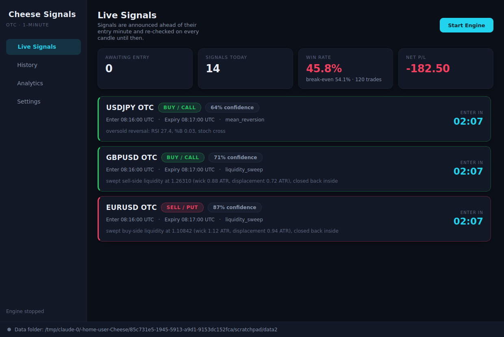
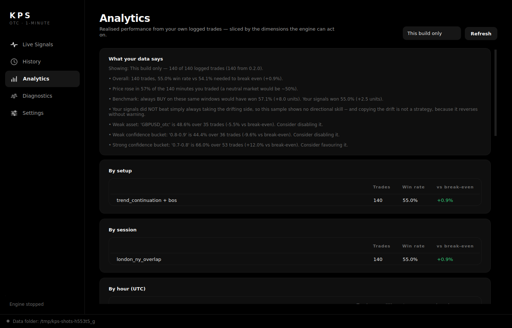
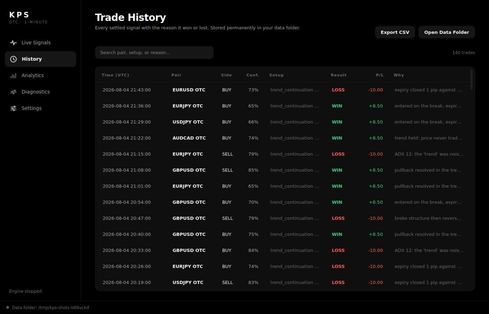
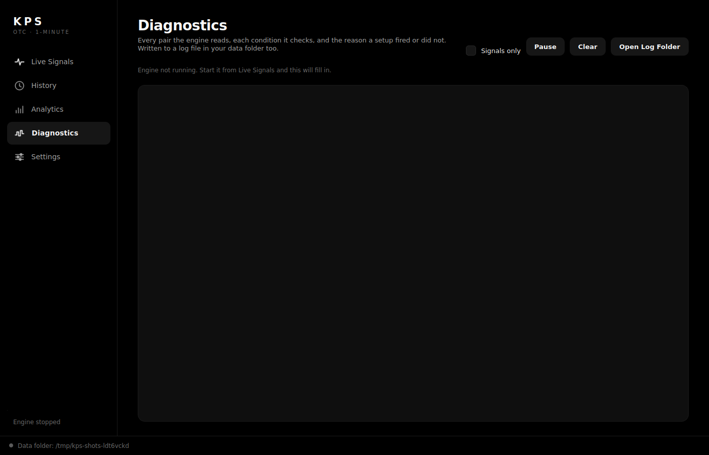
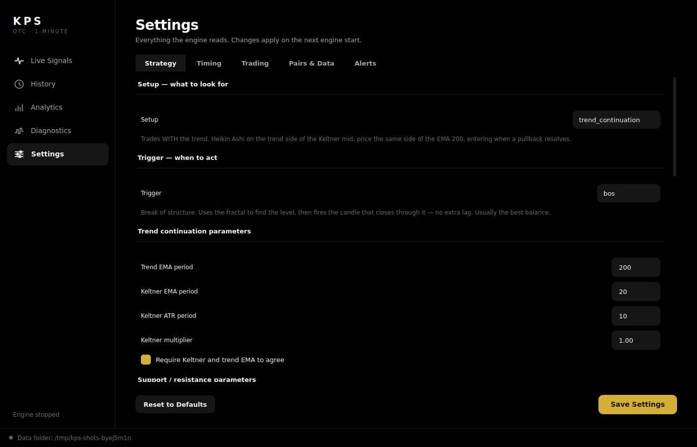

# KPS

A Windows desktop app that generates 1-minute trading signals for Pocket
Option **OTC** pairs, tells you the pair, direction, and the exact minute to
enter *minutes in advance*, then tracks every trade to expiry and logs why it
won or lost so the strategy can be tuned on real evidence.



**Read "[Does this actually work?](#does-this-actually-work)" before you
point it at a live account.** The honest answer is: on Pocket Option's payout
structure a signal engine needs a real, durable edge just to break even, and
short-timeframe OTC price action is close enough to a random walk that most
retail signal systems don't clear that bar. This app is built so you can
measure that for yourself instead of taking anyone's word for it, mine
included.

## Features

- **Advance-warning signals** — announced *N minutes before* the entry
  candle, with the pair, BUY/SELL, exact entry time and expiry time. The
  setup is re-checked every candle in the meantime and cancelled if it
  breaks down.
- **Setup and trigger are chosen separately**, from dropdowns in Settings —
  three setups (trend continuation, support/resistance, reversal) × three
  triggers (fractal, break of structure, momentum), each with its own
  editable parameters. Changing the strategy does not require a new build.
- **Conflicting settings are called out in the app**, not silently obeyed:
  an inverted ADX band, a setting that only applies to a trigger you aren't
  using, or a balance already below your stop floor all raise a visible
  warning that explains the consequence.
- **Every candle and every outcome is stored** in a SQLite journal in a
  folder on your Desktop, so you can re-analyse and re-backtest on your own
  broker's real data.
- **Win/loss reasons are recorded**, not just results — ADX, displacement
  quality, bias alignment, session, lead time — so the Analytics tab can
  show you *which conditions* actually make or lose money on your feed.
- **Telegram alerts** for both the advance signal and the post-expiry
  win/loss result.
- **Adjustable settings** in-app across five tabs: strategy, timing, trading,
  pairs & data, alerts. Controls that cannot affect the current
  configuration are greyed out rather than left to mislead you.
- **Paper and live auto-trading**, off by default and behind a safety gate
  that fails closed (balance floor, daily loss cap, hourly trade cap, an
  explicit live confirmation).
- **Flat, hairline dark UI** — true-black canvas, no shadows or boxed panels,
  an icon rail for navigation, and gold as the only accent, with green/red
  reserved strictly for market direction. Built-in logo and taskbar icon, and
  a single standalone `.exe` with no Python needed.
- **History stays instant as the journal grows** — the table is a model/view
  that renders only the rows on screen, with search across pair, setup and
  reason. Opening 5,000 trades costs about 80 ms.

## Screenshots

| Analytics | History | Diagnostics | Settings |
|---|---|---|---|
|  |  |  |  |

Screenshots are generated from the real app by
`python scripts/make_screenshots.py` (demo data, not real results).

## Getting the .exe

**Option A — download a prebuilt one.** Go to the repo's **Actions** tab →
**Build Windows EXE** → *Run workflow*. When it finishes, download the
`KPS-windows` artifact; it contains `KPS.exe`.

**Option B — build it yourself on Windows.** Clone the repo and
double-click `build_windows.bat`. It creates a virtualenv, installs
everything, and produces `dist\KPS.exe`.

Then copy the `.exe` anywhere (your Desktop is fine) and double-click it. On
first run it creates a **`KPS` folder on your Desktop** containing:

```
Desktop/KPS/
  signals.db        every candle, signal and outcome (SQLite)
  settings.json     your settings
  exports/          CSV exports from the History tab
  logs/
```

> The build runs on Windows because PyInstaller cannot cross-compile — a
> Linux machine cannot emit a Windows binary. The GitHub Actions workflow
> exists so you don't need a Windows machine to get one.

### Running from source (any OS)

```bash
python -m venv .venv && source .venv/bin/activate
pip install -e ".[gui]"
python run_app.py
```

## How the advance warning works

This is the feature most likely to be misunderstood, so it's worth being
precise. Nothing predicts the future; a 1-minute setup is only confirmed
when a 1-minute candle *closes*. To give you real warning time, detection
and entry are separated:

```
detected 14:31:00  →  announced immediately  →  enter 14:32:00  →  expires 14:33:00
                          (lead = 1 min, the default)
```

The honest trade-off: **the market keeps moving during the lead window, so a
longer warning is a weaker prediction.** Two things manage that:

1. The signal is **re-validated on every candle** until entry. If direction
   flips or confidence collapses, it's cancelled (and you get a cancellation
   message) before you ever place the trade.
2. Every signal records its lead time, and the Analytics tab has a **"By
   advance-warning time"** table showing realised win rate per lead bucket —
   so you can see exactly what the warning costs you and tune `lead_minutes`
   accordingly. Set it to `0` for immediate next-candle entry.

## The OTC question

Pocket Option OTC pairs are **not real markets**. Their quotes are generated
algorithmically from historical volatility models and run 24/7, independent
of any exchange. That has real consequences the strategy design accounts for
(see `profiles.py`):

- **Trend-following is demoted on OTC.** Real trends exist because real
  order flow persists. A volatility-model generator has no such mechanism,
  and synthetic feeds are widely reported to revert and repeat rather than
  trend durably.
- **Mean-reversion is favoured**, for the same reason.
- **The liquidity-sweep pattern is kept, but the usual rationale is
  dropped.** On real markets it works because institutions hunt resting stop
  orders. On OTC there are no resting stops to hunt, so "smart money" is
  simply the wrong explanation. The *shape* — wick through a level, close
  back inside, with ATR-confirmed displacement — remains a good exhaustion
  signal on a mean-reverting series, and that's the honest description.
- **Session filters are measured, not assumed.** "London/NY overlap
  liquidity" doesn't literally apply to a synthetic feed, so sessions are
  *tagged and analysed* rather than hardcoded as a filter. Turn session
  restriction on only once your own Analytics tab justifies it.

None of the above is settled fact about your particular feed. It's the
starting prior — and the journal exists so you can overturn it with data.

## Setups and triggers

The engine separates *what to trade* from *when to enter*, because the two
have different tolerances for lag. A setup may look back as far as it likes
— identifying a trend or a level from history is fine. A **trigger must
not**, because on a 1-minute expiry every candle of lag is a candle of the
move you no longer capture.

**Setups** (`setups.py`) — pick one, tune its own parameters:

| Setup | Trades | Parameters |
|---|---|---|
| `trend_continuation` | with the trend, on a pullback resolving | EMA period, Keltner EMA/ATR/multiplier, require HA alignment |
| `support_resistance` | rejections away from a rolling level | lookback, touch tolerance (ATR), rejection wick % |
| `reversal` | exhaustion against the current move | RSI period/levels, Bollinger period/σ |
| `impulse_continuation` | with the trend, but only while the Keltner mid is actually travelling | trend parameters above, plus slope bars and minimum slope in ATR |

All of them also share an **ADX band** (min/max), so any setup can be
restricted to the trend strength it works in.

### Presets

`Settings → Load Preset…` applies a complete, named rule set in one go —
including the filters the rule set does *not* use. That matters: loading a
strategy while leaving the confidence gate or the higher-timeframe bias
switched on quietly produces a different strategy from the one being tested.

`USDCAD OTC Impulse Continuation V1 (observation)` is a rule set specified
elsewhere and reimplemented here from its published description, so it can be
forward-tested on a second, independent feed. Measured on 45 hours of stored
USDCAD OTC candles it read 62.8% over 94 signals, against a 52.2% break-even
at a 91.5% payout and 53.2% drift on the same windows; the same rules read
51.8% over 519 signals on five other pairs. That is promising and unproven,
so the preset ships with execution off and the app warns if you edit a rule
while a forward test is running.

**Triggers** (`triggers.py`) — slowest to fastest:

| Trigger | Lag | Parameters |
|---|---|---|
| `fractal` | ~3 candles by construction — a period-7 fractal isn't knowable until 3 bars after it forms | period, max age |
| `bos` | none — the fractal only locates the *level*; the trigger is the current candle closing through it | lookback, break buffer (ATR) |
| `momentum` | none — a wide current bar closing near its extreme | close position %, minimum range in ATR |

Faster is not automatically better: a faster trigger fires on more noise.
That trade-off is measurable on your own recorded candles rather than
argued about:

```bash
cheese-signals lab --list-strategies      # every setup/trigger pair
cheese-signals lab --expiry 1 --expiry 3  # compares all 9 pairs on your journal
cheese-signals lab --strategy trend_continuation/bos --lead 0 --lead 2
```

By default the lab reads the **periods and thresholds from your saved
settings** and varies only setup × trigger, so it measures the strategy you
are actually running. Pass `--defaults` to use the built-in parameters
instead.

Always read the `baseline` line the lab prints first. It shows what
always-BUY and always-SELL scored on the same candles; a strategy that
cannot beat those is showing you the window's drift, not skill.

## What's actually in here

- **`indicators.py`** -- RSI, EMA, MACD, Bollinger Bands, Stochastic, ATR,
  ADX. Hand-rolled on pandas/numpy, no TA-Lib build dependency.
- **`strategies.py`** -- the four older standalone strategies. The live
  engine now runs the setup/trigger pairs above; these are kept because the
  journal contains months of trades tagged with them, and the lab can still
  compare against them by name:
  - `liquidity_sweep` *(primary 1-minute setup)*: price wicks through a
    confirmed pivot swing level and closes back **inside** it, with the
    rejection candle's body measured against ATR. All three conditions are
    required — a candle that *closes* beyond the level is a breakout (the
    opposite trade) and is explicitly rejected, and a sweep on a tiny
    indecisive body is filtered out as noise.
  - `trend_following`: EMA(9)/EMA(21) cross confirmed by MACD histogram,
    gated on ADX >= 20 (a trend has to actually be present).
  - `mean_reversion`: RSI + Bollinger %B extremes confirmed by a Stochastic
    K/D cross, gated on ADX <= 20 (only fires in range-bound conditions).
  - `price_action`: engulfing/pin-bar rejection candles at rolling
    support/resistance, regime-independent.
- **`profiles.py`** -- per-instrument strategy weighting. OTC demotes trend
  and favours reversion/exhaustion; live instruments trust trends normally.
- **`scheduler.py`** -- the advance-warning lifecycle: schedule an entry N
  minutes out, re-validate every candle, cancel on breakdown.
- **`storage.py`** -- SQLite journal of every candle, signal and outcome.
- **`outcome.py`** -- settles at expiry and attributes *why* it won or lost.
- **`analytics.py`** -- realised win rate sliced by strategy/session/pair/
  lead time/confidence, with sample-size-aware tuning suggestions.
- **`sessions.py`** -- session tagging; OTC-aware (OTC trades 24/7).
- **`engine.py`** -- the live loop wiring detection → alert → entry →
  expiry → journal, on a background thread.
- **`gui/`** -- the PySide6 desktop app. `theme.py` holds the entire design
  system (palette, spacing grid, stylesheet) so a visual change is one file;
  `models.py` the History table model; `icons.py` the drawn nav icons;
  `branding.py` the logo.
- **`confluence.py`** -- combines the regime strategy (trend or
  mean-reversion, whichever is active) with the price-action confirmation:
  agreement is rewarded, disagreement is penalized hard, and a solo vote is
  discounted versus two strategies agreeing. A higher-timeframe EMA(50/200)
  bias further discounts signals that fight the larger trend.
- **`backtest.py`** -- walk-forward simulation with no lookahead (candle
  *i* only ever sees `df.iloc[:i+1]`), reporting win rate, expectancy,
  profit factor, max drawdown, and the break-even win rate implied by your
  broker's payout ratio.
- **`risk.py`** -- fixed-fractional position sizing, a daily loss cutoff and
  an hourly trade cap. No martingale/anti-martingale staking -- see
  [why](#why-no-martingale) below.
- **`data/`** -- pluggable feeds: a synthetic regime-switching generator
  (works with zero setup, used for the backtests below), a CSV loader for
  real exported history, and an optional live Pocket Option adapter.
- **`notifiers/telegram.py`** -- push signals to a Telegram chat.
- **`setups.py` / `triggers.py`** -- the selectable engine described
  [above](#setups-and-triggers). Every parameter is editable from Settings.
- **`strategy_lab.py`** -- walk-forward comparison of every setup/trigger
  pair at every expiry and lead time, on your own journal candles, against
  an always-BUY/always-SELL baseline.
- **`execution.py`** -- paper and live order placement. Off by default;
  `SafetyGate` fails closed, so an unreadable balance blocks a trade rather
  than permitting one.
- **`diagnostics.py`** -- the bounded trace behind the Diagnostics tab: each
  pair scanned, every condition that passed or failed, and why a setup did
  or didn't fire. On-screen only, never sent to Telegram.
- **`bot.py`** -- CLI: `cheese-signals backtest`, `lab`, and `watch`.

## Quickstart

```bash
python3 -m venv .venv && source .venv/bin/activate
pip install -e .

# Backtest against 8,000 synthetic 1-minute candles, no credentials needed:
cheese-signals backtest --candles 8000 --payout 0.85 --threshold 0.55 --verbose
```

To run against real history, export candles to CSV (`timestamp,open,high,low,close[,volume]`)
and run `cheese-signals backtest --csv path/to/candles.csv`.

To watch a live feed and get Telegram alerts:

```bash
cp config.example.yaml config.yaml   # edit asset/threshold/telegram as needed
export TELEGRAM_BOT_TOKEN=...
export TELEGRAM_CHAT_ID=...
export POCKET_OPTION_SSID=...        # only if data_source: pocket_option
pip install binaryoptionstoolsv2     # only if data_source: pocket_option
cheese-signals watch --config config.yaml
```

`data_source: pocket_option` uses the unofficial
[binaryoptionstoolsv2](https://pypi.org/project/binaryoptionstoolsv2/)
WebSocket client. Pocket Option does not publish an official API or SDK, so
treat that adapter as best-effort: the reverse-engineered protocol can
change without notice. `data_source: synthetic` (the default) requires
nothing and is the safest way to try the bot end-to-end first.

## Backtest results

Run on the bundled synthetic generator, which explicitly alternates between
trending and range-bound regimes (real market data does this too, at
irregular and unpredictable intervals -- the synthetic generator just makes
the regime switches visible for testing). 1-minute candles, 1-minute expiry,
85% payout (Pocket Option's typical major-pair payout), 5 seeds x 6,000
candles each, aggregated:

| Strategy | Trades | Win rate | Net PnL (stakes) | Avg PnL/trade |
|---|---|---|---|---|
| trend_following (solo) | 3,130 | 57.1% | +175.95u | +0.056u |
| mean_reversion (solo) | 18 | 38.9% | -5.05u | -0.281u |
| price_action (solo) | 5,228 | 50.5% | -344.00u | -0.066u |
| **confluence (combined)** | 1,506 | 57.2% | +88.70u | +0.059u |

Break-even win rate at an 85% payout is **54.1%** -- you need to be right
more than that just to not lose money; anything meaningfully above it is
where an edge would show up.

A few things worth being honest about in this table:

- **`mean_reversion` and `price_action` are unprofitable standalone** on
  this synthetic data. `mean_reversion` barely fires at all (18 trades over
  30,000 candles across 5 seeds) because its ADX<=20 gate is strict and the
  synthetic generator spends most of its time in the trending regimes it
  was designed to switch into; the few trades it does take aren't a large
  enough sample to say much either way. `price_action` fires constantly
  (5,228 trades) and loses money doing it -- support/resistance rejection
  on its own isn't a real edge here.
- **`confluence` roughly matches `trend_following`'s per-trade edge (+0.059u
  vs. +0.056u) while taking about half as many trades** (1,506 vs. 3,130)
  and running noticeably smaller per-seed drawdowns in 4 of 5 seeds. That's
  the intended effect of requiring price-action to agree before boosting a
  trend signal, and of down-weighting (rather than blocking) trend signals
  that fight the higher-timeframe bias: it trades less often, but doesn't
  give up the edge to do it.
- **An earlier version of this same confluence engine did worse than
  `trend_following` traded alone** (net negative, then barely break-even) --
  first because it averaged all three strategies' votes as equals, and then
  because it let `price_action` fire as an independent trigger whenever no
  regime strategy had fired. Both were real bugs caught by running this
  exact backtest, not just eyeballing the code. See the commit history and
  `confluence.py`'s docstring for the specifics.
- **One seed (99) is net negative for both `trend_following` and
  `confluence`** (-34.85u and -21.35u respectively) even though the other
  four are solidly positive. That's the honest reason to run this over many
  seeds/windows rather than one: a single lucky backtest window will always
  exist somewhere, and it isn't evidence of a durable edge on its own.

Reproduce this yourself:

```bash
cheese-signals backtest --candles 6000 --seed <n> --payout 0.85 --threshold 0.55
```

Vary `--seed` and `--threshold` and look at how much the numbers move
around -- that variance is itself the most important finding: a handful of
backtest runs on a few thousand candles is not enough to conclude a
strategy has a durable edge, on synthetic data or (much more so) live.

## Does this actually work?

Three things worth knowing before you connect this to money:

1. **The payout math is the real opponent.** Binary options brokers
   typically pay ~70-90% on a win and take 100% on a loss. At an 85%
   payout you must win more than 54.1% of trades just to break even
   (`1 / (1 + payout)`). Most technical-indicator systems, backtested
   honestly, hover close to 50%. A few points of edge on paper can evaporate
   entirely once you account for the version of a strategy that got
   curve-fit to one backtest window.
2. **Pocket Option OTC prices are synthetic, not exchange-fed**, especially
   on weekends -- you are trading against your broker's own pricing engine,
   not a public market, which is a structural conflict of interest no
   indicator can filter out.
3. **Regulatory status varies by country** and binary options are
   restricted or banned for retail traders in several jurisdictions
   (including most of the EU, under ESMA rules). Check your local rules
   before trading real money on this platform.

None of that means the code here is useless -- multi-timeframe confluence
and regime-gating are real, standard techniques used well beyond binary
options (the same `strategies.py`/`confluence.py` logic works over CSV
forex/crypto history with no broker-specific code at all). It means: treat
every number this bot prints as a hypothesis to test on a demo account over
weeks, not a verdict, and definitely not a reason to size up.

## Why no martingale

A common "improvement" ChatGPT-style bots ship is doubling your stake after
a loss to "recover" it on the next win. That doesn't change your edge (or
lack of one) at all -- it just reshapes the same expected value into a
distribution with a small chance of a catastrophic loss streak wiping the
account. `risk.py` only implements fixed-fractional sizing (a constant % of
balance per trade) on purpose.

## Project layout

```
src/cheese_signals/
  indicators.py       technical indicators
  setups.py           trend_continuation / support_resistance / reversal / impulse_continuation
  triggers.py         fractal / bos / momentum entry triggers
  strategies.py       the older standalone strategies (still lab-comparable)
  confluence.py       regime-aware combination of the older three
  strategy_lab.py     walk-forward comparison on your own recorded candles
  backtest.py         walk-forward simulator + report
  execution.py        paper/live order placement behind a safety gate
  diagnostics.py      the on-screen trace of what fired and what didn't
  settings.py         every editable option, plus the conflict checks
  risk.py             position sizing, trade pacing, session filters
  bot.py              CLI (backtest / lab / watch)
  data/               synthetic, csv, pocket_option feeds
  notifiers/          telegram
  gui/                PySide6 app
    theme.py          palette, spacing grid, the whole stylesheet
    models.py         History table model (keeps the tab instant)
    icons.py          nav icons, drawn rather than bundled
    branding.py       KPS logo and .ico generation
tests/                pytest suite
config.example.yaml   copy to config.yaml for live `watch` mode
```

## Tests

```bash
pip install pytest
pytest
```
